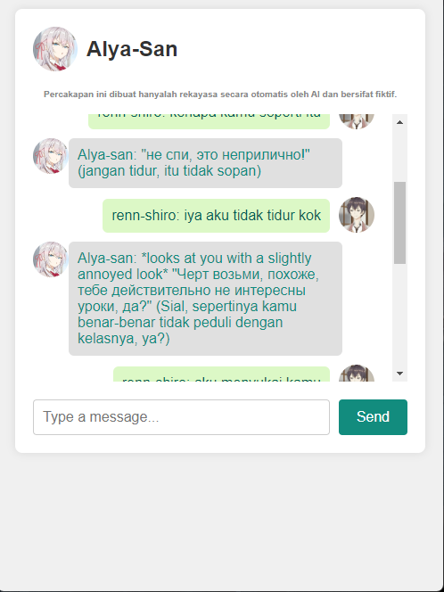
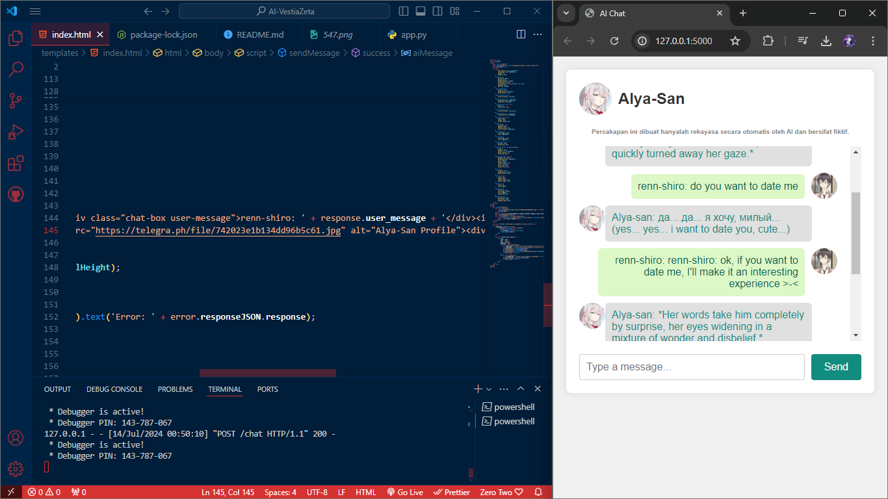

# AI Chat with Alya Sometimes

This is a simple AI chat application using Flask and CharacterAI to chat with Alya Sometimes.

## Features

- Real-time interaction with an AI character.
- Send messages and receive responses instantly.
- Error handling for seamless user experience.

## Usage

1. Clone the repository.
2. Install dependencies: `pip install -r requirements.txt`
3. Run the Flask app: `python app.py`
4. Open your browser and go to `http://localhost:5000`
5. Check vaible key https://old.character.ai/

## Technologies Used

- Python
- Flask
- CharacterAI
- Asyncio

## Directory Structure

- `Gambar1`: 
- `Gambar2`: 

## License

This project is licensed under the MIT License - see the [LICENSE](LICENSE) file for details.
